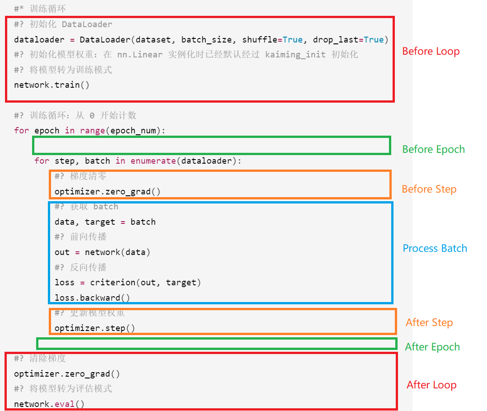

# 深度模型训练框架

本项目旨在开发一个自用的深度学习项目的训练框架，使用面向对象编程的思想对其中的组件和功能进行抽象，从而使整个框架方便使用和拓展。

## [2023.10.27]

### 一个基础的训练脚本是怎样的？

一个只包含最基础训练功能——多轮 epoch 梯度下降——的训练脚本应该包含以下部分

基础超参数：

- 训练轮次 `epoch_num`
- 批次大小 `batch_size`

基础组件：

- 数据集 `Dataset`
- 神经网络 `Network`
- 损失函数 `Loss`
- 优化算法 `Optimizer`

基础训练流程：

1. 训练前：
   1. 根据 `Dataset` 和 `batchsize` 初始化 `DataLoader`
   2. 初始化模型 `Network` 权重
   3. 将模型转化为训练模式
2. 训练中：循环以下步骤
   1. 从 `DataLoader` 获取一个 `batch`
   2. 使用 `Optimizer.zero_grad()` 方法清除模型权重的梯度
   3. 前向传播：使用神经网络 `Network`、损失函数 `Loss` 对这一批数据 `batch` 计算损失值 `loss_value`
   4. 反向传播：使用 `loss_value.backward()` 方法反传梯度
   5. 使用 `Optimiezer.step()` 更新模型参数
3. 训练后：
   1. 清除权重梯度
   2. 将模型转为评估模式

```Python
def train(components, hyperparams):
    #? 训练组件
    dataset = components.dataset
    network = components.network
    criterion = components.criterion
    optimizer = components.optimizer
    #? 训练超参数
    epoch_num = hyperparams.epoch_num
    batch_size = hyperparams.batch_size
    learning_rate = hyperparams.learning_rate
    #* 训练循环
    #? 初始化 DataLoader
    dataloader = DataLoader(dataset, batch_size, shuffle=True, drop_last=True)
    #? 初始化模型权重：在 nn.Linear 实例化时已经默认经过 kaiming_init 初始化
    #? 将模型转为训练模式
    network.train()

    #? 训练循环：从 0 开始计数
    for epoch in range(epoch_num):

        for step, batch in enumerate(dataloader):
            #? 梯度清零
            optimizer.zero_grad()
            #? 获取 batch
            data, target = batch 
            #? 前向传播
            out = network(data)
            #? 反向传播
            loss = criterion(out, target)
            loss.backward()
            #? 更新模型权重
            optimizer.step()
            
    #? 清除梯度
    optimizer.zero_grad()
    #? 将模型转为评估模式
    network.eval()
```

### 如何设计可拓展的训练流程？

- 分隔嵌套层，将循环过程划分为互不相交的范围（scope）。
- 将现有功能填入合适的范围，未来拓展功能时，将新功能加入它们应该在的范围内。

我们将训练过程划分为 7 个范围：

1. 训练前 Before Loop
2. 每轮前 Before Epoch
3. 每步前 Before Step
4. 批数据 Process Batch
5. 每步后 After Step
6. 每轮后 After Epoch
7. 训练后 After Loop



## [2023.10.29]

### 基础功能增加：梯度累计

为训练循环加入梯度累积的功能，这也是将反向传播梯度的更新参数分到两个不同的范围的初衷。实际使用的 batch 数是梯度累积常数 `k` 的整数倍，那么当选择的 batch_size 使 data_loader 的长度不是 `k` 的整数倍时，我们选择将长度拓展凑成整数倍。
